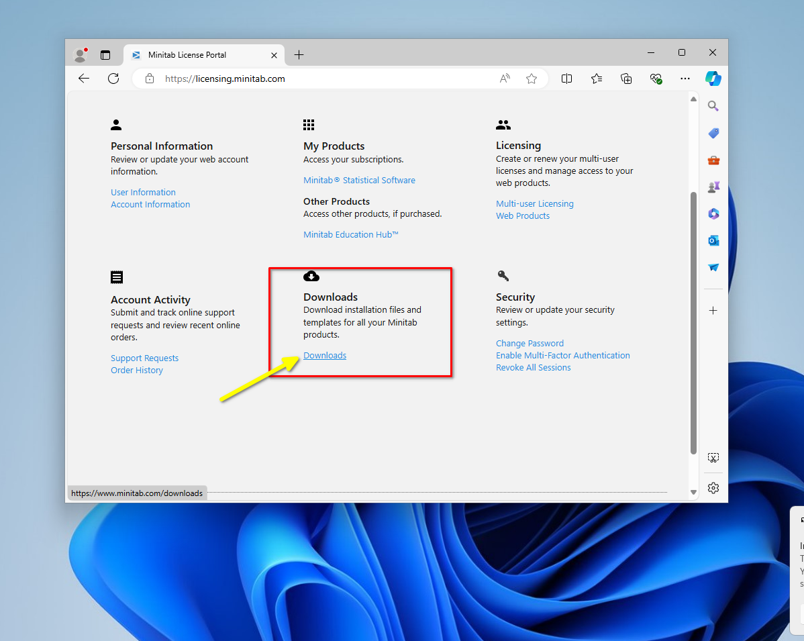

# Huớng dẫn cài đặt BowtieXP
1. Tải phần mềm
- Truy cập website: [Bowtie Download](https://www.bowtiexp.com/downloads/bowtiexp/)
- Tải về

2. Cài đặt
- Chọn **"I accept term ..."** và Bấm **"Install"**

- Nếu hiện cửa sổ popup yêu cầu quyền. Chọn **"Yes"**

- Đợi chuơng trình hoàn thành cài đặt. Ấn **"Finish"** để kết thúc

- Mở chuơng trình và nhập code đã cung cấp

# Huớng dẫn cài đặt MiniTab
1. Tải phần mềm
- Truy cập website [Minitab](https://licensing.minitab.com)

- Đăng nhập với tài khoản đuợc cung cấp

- Tải phần mềm

2. Cài đặt 
- Giải nén và Cài đặt

- Cuộn xuống Agreement, tích chọn **"Acccept"** và ấn **"Next"**

- Chọn "Start the free trial"

- Chờ đợi cài đặt hoàn tất

- Mở phần mềm, chọn option **"Sign In"**

- Đăng nhập với tài khoản đuợc cung cấp và quay lại sử dụng phần mềm

